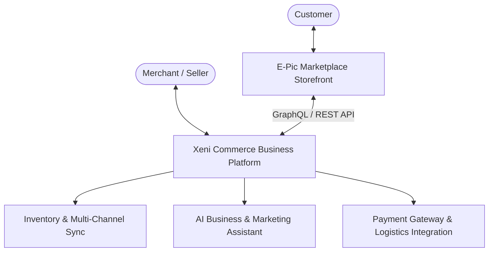

# 🛍️ E-Pic Marketplace

> **Bangladesh's Next-Gen AI-Powered E-Commerce Storefront**  
> Free for customers and sellers to list • Powered by **Xeni Commerce**

---


## 📌 Overview

**E-Pic Marketplace** is a high-performance, glassmorphic customer-facing shopping platform engineered for Bangladesh. Designed with state-of-the-art Web aesthetics, fluid motion, and intelligent product discovery, E-Pic delivers a premium shopping experience superior to traditional Bangladeshi e-commerce platforms.

Under the hood, E-Pic seamlessly integrates with **Xeni Commerce**, an intelligent backend platform that manages inventory, multi-channel orders, AI marketing, seller shop generation, and automated business analytics.

---

## ✨ Key Features

- 💎 **Glassmorphic UI / UX**: Modern dark theme with dynamic lighting, smooth backdrop blur, interactive hover effects, and Framer Motion micro-animations.
- 🚀 **Lightning Fast Storefront**: Built on Next.js 15 App Router with server/client optimization and instant state updates via Zustand & React Query.
- 🔍 **Smart Discovery**: Live search auto-complete, category filters, and curated collection grids (Hot Deals, Trending, Top Stores).
- 🛒 **Interactive Shopping Cart & Drawer**: Dynamic slide-out cart drawer, live price calculations, quantity modifiers, and local state persistence.
- 🤖 **AI Commerce Integration**: Ready for AI Shopping Assistant, smart product recommendations, and automated seller assistance.
- 📱 **Mobile-First Responsive Design**: Optimized experience across mobile, tablet, and desktop screens with custom touch-friendly menus.
- 🛡️ **Zero Seller Fee Model**: Completely free product listing platform for local entrepreneurs and digital merchants.

---

## 🛠️ Tech Stack

| Domain | Technology |
| :--- | :--- |
| **Framework** | [Next.js 15](https://nextjs.org/) (App Router, TypeScript) |
| **Styling** | [Tailwind CSS v4](https://tailwindcss.com/) + Custom Glassmorphism CSS Tokens |
| **Animations** | [Framer Motion](https://www.framer.com/motion/) |
| **State Management** | [Zustand](https://zustand-demo.pmnd.rs/) (Persisted Cart & UI State) |
| **Data Fetching** | [@tanstack/react-query](https://tanstack.com/query) |
| **Icons** | [Lucide React](https://lucide.dev/) |
| **Toast Notifications** | [React Hot Toast](https://react-hot-toast.com/) |
| **Backend Integration** | [Xeni Commerce API](https://xeni.co) |

---

## 📁 Project Structure

```text
epic-marketplace/
├── src/
│   ├── app/                    # Next.js App Router (Layouts, Pages, APIs)
│   │   ├── layout.tsx          # Root Layout with Providers, Navbar & Footer
│   │   ├── page.tsx            # Full-featured Glassmorphic Storefront Homepage
│   │   └── globals.css         # Glassmorphism Design Tokens & Utilities
│   ├── components/             # Reusable UI Components
│   │   ├── cart/               # Cart Drawer & Cart Item Components
│   │   ├── layout/             # Navbar, Footer, Providers
│   │   └── ui/                 # Glass Buttons, Star Rating, Badges
│   ├── lib/                    # Utility Functions, Helpers, Formatters
│   ├── services/               # API Service Layer (Xeni Commerce Connector)
│   ├── stores/                 # Zustand Global State (Cart, UI, User)
│   └── types/                  # TypeScript Data Schemas & API Contracts
├── public/                     # Static Assets & Icons
├── next.config.mjs             # Next.js Configuration
└── tailwind.config.ts          # Tailwind CSS Configuration
```

---

## 🚀 Getting Started

### Prerequisites

- **Node.js** >= 18.x
- **npm** >= 9.x

### Installation

1. **Clone the Repository:**
   ```bash
   git clone git@github.com:XenDevHub/epic-ecommerce.git
   cd epic-ecommerce
   ```

2. **Install Dependencies:**
   ```bash
   npm install
   ```

3. **Set Up Environment Variables:**
   Create a `.env.local` file in the root directory:
   ```env
   NEXT_PUBLIC_SITE_URL=http://localhost:3000
   NEXT_PUBLIC_XENI_API_URL=https://api.xeni.co/v1
   ```

4. **Run the Development Server:**
   ```bash
   npm run dev
   ```
   Open [http://localhost:3000](http://localhost:3000) in your browser.

---

## 🔗 Xeni Commerce Ecosystem Architecture



---

## 📄 License

Distributed under the MIT License. See `LICENSE` for more information.

---

<p center>
  Made with ❤️ for Bangladesh by <strong>XenDevHub</strong> & <strong>Xeni Commerce Team</strong>
</p>
